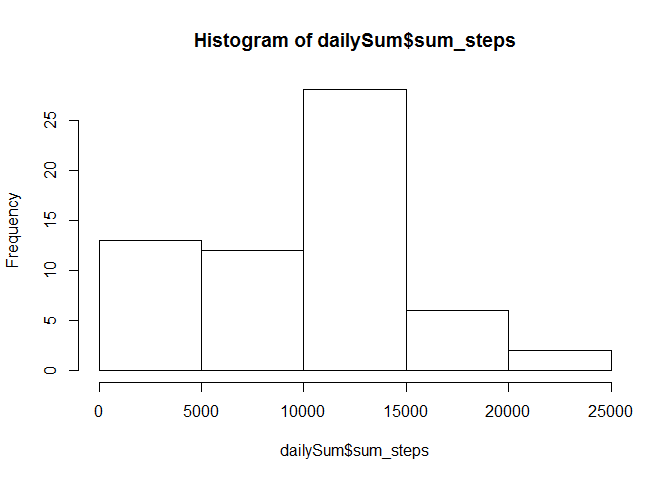
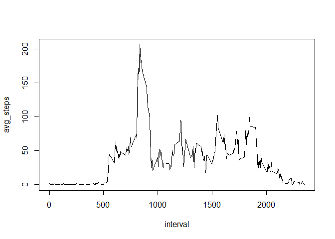
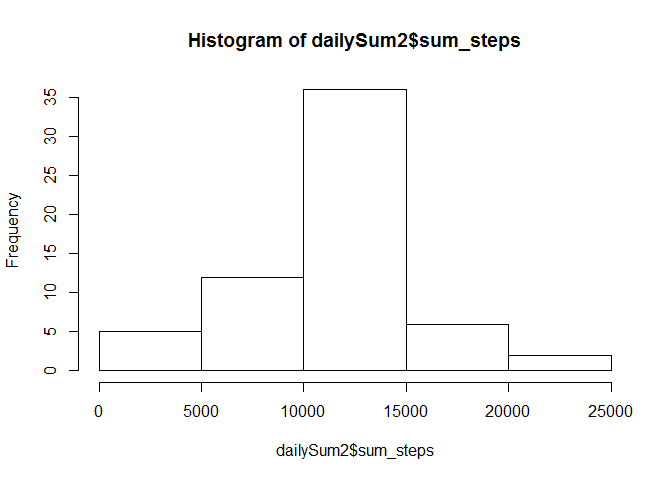
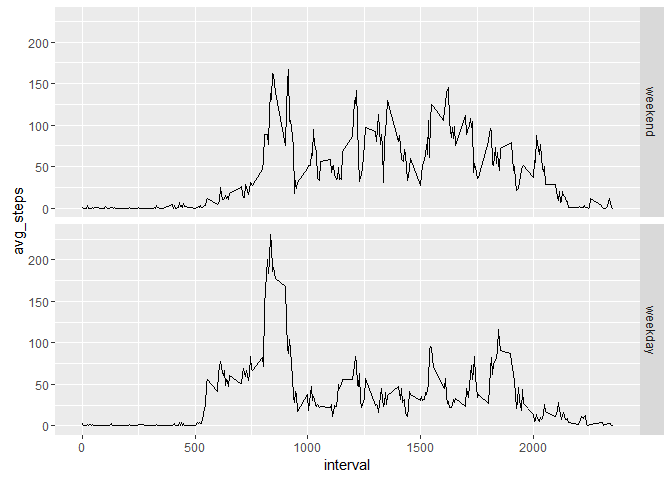

# Reproducible Research - Peer Assessment 1
Ashton Wu  


## Loading and preprocessing the data
For this assignment, we are using the "Activity monitoring data" from a personal activity monitoring device from an anonymous individual. The commented code below downloads and unzips the dataset (in csv format) if necessary.

```r
# library(downloader)
# 
# if(!file.exists("./Repdata.zip")){
#   fileUrl = "https://d396qusza40orc.cloudfront.net/repdata%2Fdata%2Factivity.zip"
#   download(fileUrl, dest="Repdata.zip", mode="wb")
#   unzip("Repdata.zip")
# }
```

Let's read and transform the dataset into a data frame called "activity".

```r
activity = read.csv("activity.csv")
activity$date = as.Date(activity$date)
```

## What is mean total number of steps taken per day?
We'll create another data frame for the daily total number of steps called "dailySum", then  calculate the mean, median, and plot a histogram.

```r
library(plyr)
dailySum = ddply(activity, .(date), summarise, sum_steps = sum(steps, na.rm=TRUE))
mean(dailySum$sum_steps)
```

```
## [1] 9354.23
```

```r
median(dailySum$sum_steps)
```

```
## [1] 10395
```

```r
hist(dailySum$sum_steps)
```

<!-- -->

## What is the average daily activity pattern?
Let's create another data frame with the average number of steps at each 5-minute interval called "avgDay", and plot the time series. We can also determine when the maximum number of steps is typically taken. 

```r
avgDay = ddply(activity, .(interval), summarise, avg_steps = mean(steps, na.rm=TRUE))
plot(avgDay, type="l")
```

<!-- -->

```r
max_steps = max(avgDay$avg_steps)
maxStepsInterval = avgDay[avgDay$avg_steps == max(avgDay$avg_steps), 1]
```
Looks like on average the individual is most active with 206.1698113 steps at the 835 minute mark.

## Imputing missing values
Note that there are a number of days/intervals where there are missing values. The presence of missing days may introduce bias into some calculations or summaries of the data. Let's replace the missing values with the mean number of steps for the corresponding 5-minute interval.

```r
countNA = sum(is.na(activity$steps))
#Add column for avg_steps from avgDay by interval value
activity2 = merge(activity, avgDay, by="interval", all.x=TRUE)
activity2 = arrange(activity2, date, interval)
#Replace all NA values for steps with the corresponding avg_steps
activity2$steps[is.na(activity$steps)] = activity2$avg_steps[is.na(activity$steps)]

dailySum2 = ddply(activity2, .(date), summarise, sum_steps = sum(steps))
mean(dailySum2$sum_steps)
```

```
## [1] 10766.19
```

```r
median(dailySum2$sum_steps)
```

```
## [1] 10766.19
```

```r
hist(dailySum2$sum_steps)
```

<!-- -->

By replacing all of the missing values, we can see that our mean and median are greater than they were originally. We can also visually see the histogram skew more to the right. 

## Are there differences in activity patterns between weekdays and weekends?
We're curious to see if there is a significant difference between weekends and weekdays. We'll factor the date into these two groups, and plot the time series of the average number of steps.

```r
library(ggplot2)
activity2$weekday = factor((weekdays(activity2$date) %in% c('Saturday', 'Sunday')), 
                           levels=c(TRUE, FALSE), labels=c('weekend', 'weekday'))
avgDay2 = ddply(activity2, .(interval, weekday), summarise, avg_steps = mean(steps))
g = ggplot(avgDay2, aes(interval, avg_steps))
g + geom_line() + facet_grid(weekday ~ .)
```

<!-- -->
